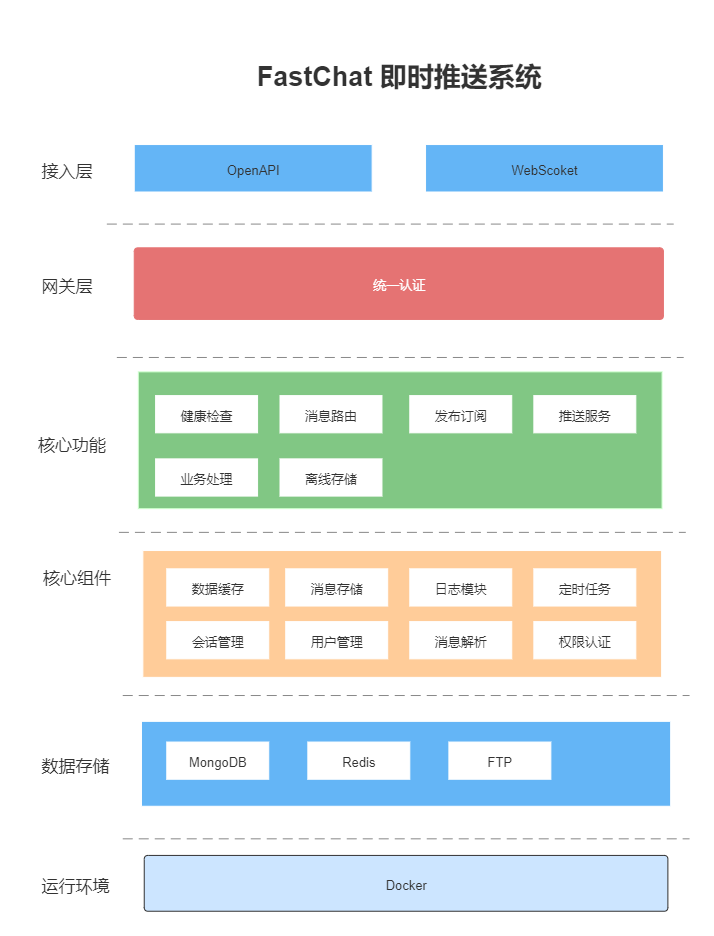
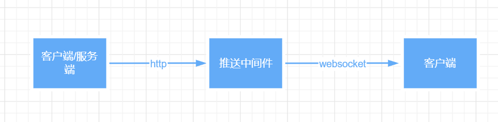

# FastChat 即时通讯

#### 作者: edison

#### 邮箱：edisonlil@163.com

---

### FastChat 介绍

一个基于Golang开发的企业级即时通讯框架。

### 框架设计

FastChat 在设计上是作为一个纯粹的独立的第三方消息发送平台，发送方采用统一 OpenAPI 进行接入进行消息发送，接收方通过 websocket 在 FastChat 上进行注册并接受信息。

FastChat 与系统业务无关，仅仅作为一个服务端 & 客户端的消息中间件。服务端即消息发送方， 客户端即消息接收方。 

客户端在通过平台ID & 用户唯一ID 进行 websocket 注册并持有 FastChat 中一个 Session。 服务端向指定平台的用户进行消息发送，用户不存在或用户不在线时消息将进行持久化存储。直到用户上线并接收该消息。

### 框架核心组件说明

### 支持功能

* 点对点发送消息 & 发布订阅（初期只支持对相同的平台的用户进行群发）
* 离线消息持久化存储
* 消息过期机制清除
* 丰富的消息类型（text，json，video，raw）

### FastChat 发布消息流程

1.问题1： Session & 用户的关系  用户包含 SessionId

1. 连接websocket 注册？ or 单独提供注册接口？  凭证是否是安全的?

2. 服务端怎么给指定的用户进行发送？ 服务端代表一个什么角色,怎么进行授权

3. 群组应该怎么进行体现？  目前想的解决方案 将平台抽象为namespace, 将群组抽象为 topic  

名词解释
 1. namespace -- 平台
 2. topic -- 群组
 3. user -- 用户
 4. session -- ws连接

用户绑定一个平台， 平台和平台之间资源相互隔离。
群组为多个用户的集合
会话绑定用户， 可通过用户找到指定会话，如会话消亡则视为用户不在线

客户端先在指定的namespace中注册user，拿到token，再去连接ws

服务端直接通过namespace去获取user